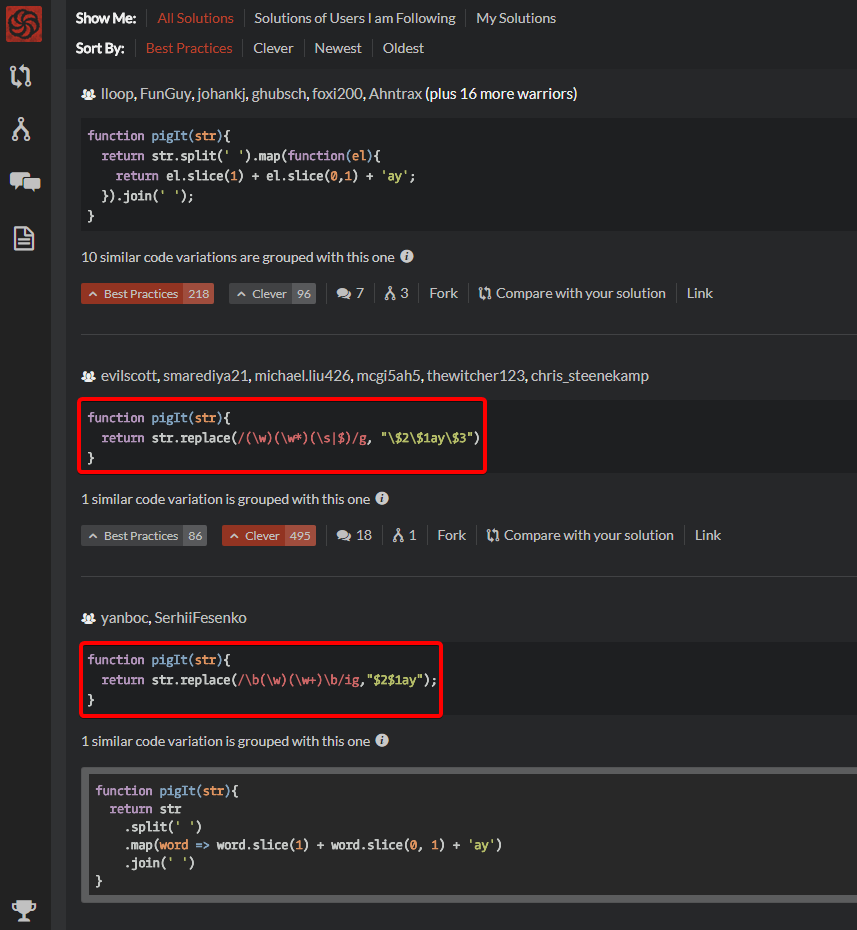
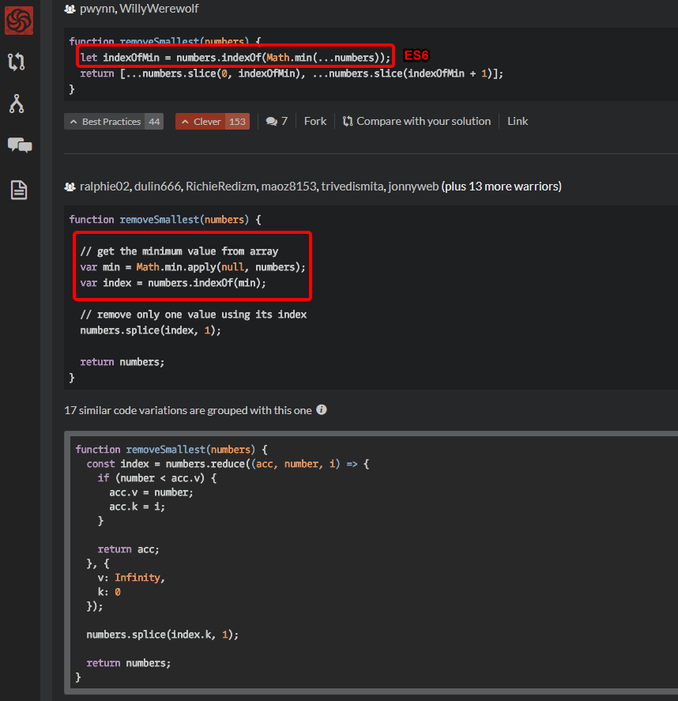
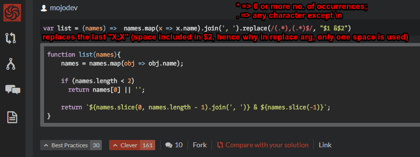
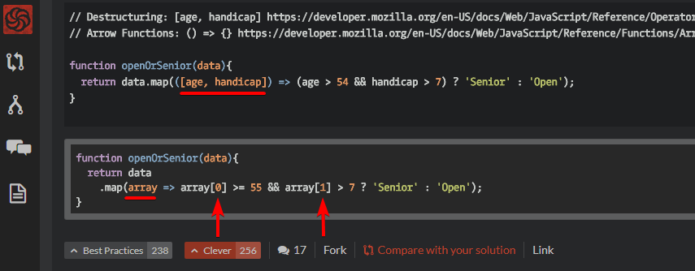
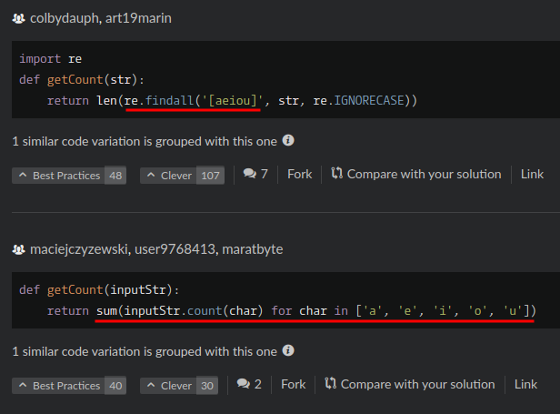
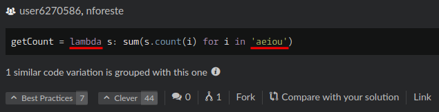

# codewars-best-solutions
From which new tricks and lessons can be learnt.

# JavaScript
- Using RegExp's Capturing Groups to manipulate strings
- Third solution is better / simpler / less bug-prone (according to comments)
- Groups:
    1. First character of word
    2. Remaining characters of word
- \b => Word boundary (used to match word; e.g: /\b(\w*)\b/g)
- \w => Any alphanumeric character including the underscore; equivalent to [A-Za-z0-9_]
- <a href="https://www.codewars.com/kata/520b9d2ad5c005041100000f">Link</a>

----------

- Calling functions that accepts multiple arguments using an Array
- <a href="https://www.codewars.com/kata/remove-the-minimum">Link</a>

----------

- Using RegExp's Capturing Groups to manipulate strings
- Own solution is pretty interesting and simple as well.
- String interpolation used to separate last item of array.
- <a href="https://www.codewars.com/kata/format-a-string-of-names-like-bart-lisa-and-maggie">Link</a>

----------

- Using Array Destructuring for better readability
- Avoids annoying array[n]
- <a href="https://www.codewars.com/kata/categorize-new-member">Link</a>

# Python
- Vowel Count
    1) Using Regex
    2) Using List Comprehension: an elegant way to define and create lists based on existing lists
- <a href="https://www.codewars.com/kata/54ff3102c1bad923760001f3/python">Link</a>

- Lambda function: Small anonymous function

----------